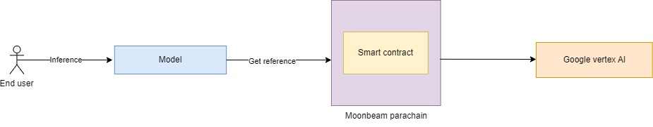
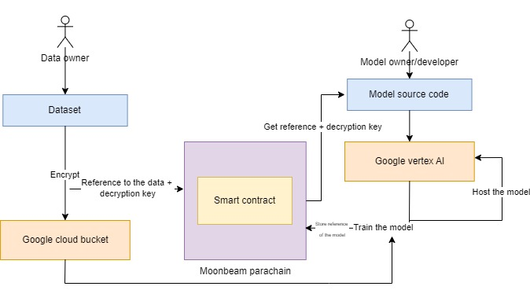

 
    
 

<strong style="font-size: 24px;">Decentralized Data Sharing Platform</strong>

    
        
        
        
    

---

### What is WEDD?
WEDD is a decentralized platform designed to solve data ownership issues and establish fair compensation for data providers. It fractionalizes data into verifiable components, converting them into NFTs to ensure proper usage and enable loyalty payments. WEDD also empowers data scientists to create models with clear provenance and automatically distribute inference payments. By using a distributed ledger for ownership verification and employing Moonbeam's EVM compatibility, the platform conducts transparent payment splitting between data owners and model creators. Additionally, WEDD integrates decentralized storage for data integrity and provenance tracking, providing a robust solution for managing and safeguarding data rights in the AI era.

### Features
- **Moonbeam Integration:** Built on Moonbeam's parachain to leverage Ethereum compatibility while benefiting from Polkadot's security and interoperability.
- **Smart Contract Framework:** Implemented using Solidity and Hardhat for robust ownership verification and payment distribution.
- **Data Ownership Registry:** Tracks the provenance and usage rights of all datasets in the ecosystem.
- **Custom Data NFT Standard:** Defined using ERC standards, allowing for fractional ownership and transparent royalty payments.
- **Model Registry:** Tracks AI models and their training data sources for fair attribution.
- **Automatic Payment Distribution:** Smart contracts that split inference payments between data owners and model creators.
- **Decentralized Storage:** Integration with IPFS for secure and verifiable data storage.
- **Privacy-Preserving Computation:** Allows model training and inference without exposing raw data.

### Conceptual Design

### Technical Architecture

### Demo
- [Demo](https://youtu.be/-1HFS6fdr9k) (20 Apr 2025)

### Images

### Roadmap

- [x] Develop Data Ownership Registry on Moonbeam
- [x] Build a data distribution library in python
- [x] Beta UI for accessing and uploading data
- [ ] Develop royalties payment
- [ ] Develop model referencing smart contract
- [ ] Develop model outsourcing to GCP
